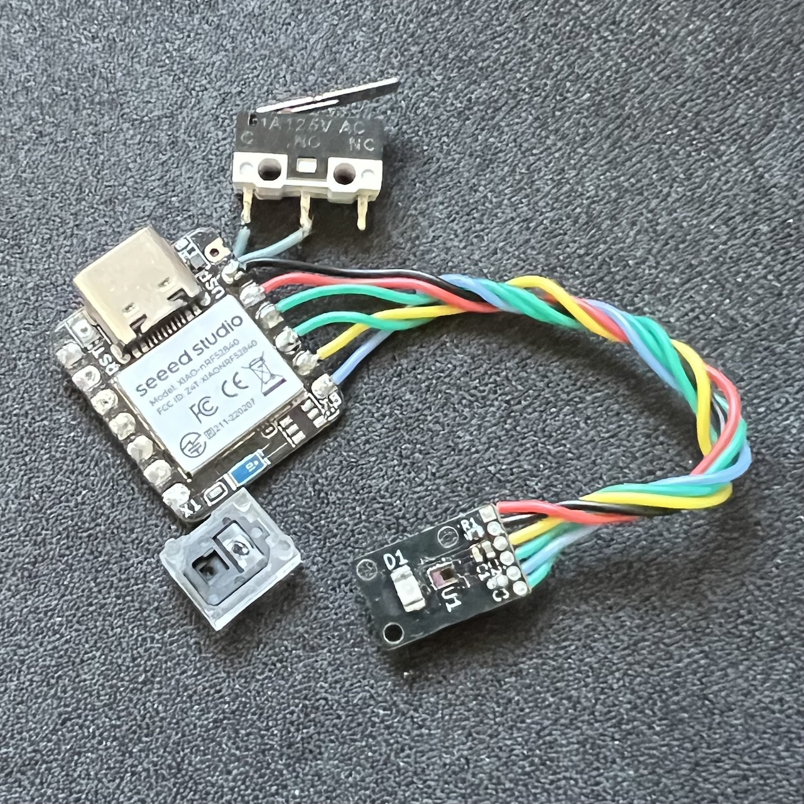

# PAW3222 PCB

[PixArt PAW3222LU-TJDU](https://www.pixart.com/products-detail/16/PAW3222LU-TJDU) low power laser mouse sensor breakout board.

- Be operated with 3.3V voltage level ONLY.
- Outlined as narrow as possible for side mount horizontally and perpendicular on low profile keyboards.

*Figure 1: Size comparing to Seeed XIAO BLE*

## PCB

Online preview avaliable [here](https://kicanvas.org/?github=https%3A%2F%2Fgithub.com%2Fbadjeff%2Fpaw3222-pcb), powered by [KiCanvas](https://github.com/theacodes/kicanvas).

*Figure 2: PCB edgecuts dimension*

*Figure 3: PCB 3D View - 1.6mm FR4*

### BOM

|Designator|Footprint|Quantity|Value|LCSC Part #|
|-|-|-|-|-|
|C1|SMD 0402|1|100nF||
|C2|SMD 0402|1|10uF||
|C3|SMD 0402|1|4.7uF||
|R1|SMD 0402|1|51R||
|U1|PAW3222LU-TJDU|1|PAW3222LU-TJDU||
|D1|LTE-C216-P-W|1|LTE-C216-P-W||
|J1|1.27mm Pin header|1|1x6||

- SMD 0402 (Imperial) aka 1005 Metric.
- PAW3222LU-TJDU needs to be used with PNSR-015-RB3 lens.

### Board Characteristics

- Copper layer count: 2
- Board thickness: 1.6 mm or 1.2mm
- Board overall dimensions: 7.75 x 12.53 mm

### Voltage level config

- 3.3V logic
- VIN: 3.3V

## License

Available under the [CERN-OHL-P v2](/LICENSE) permissive license.
